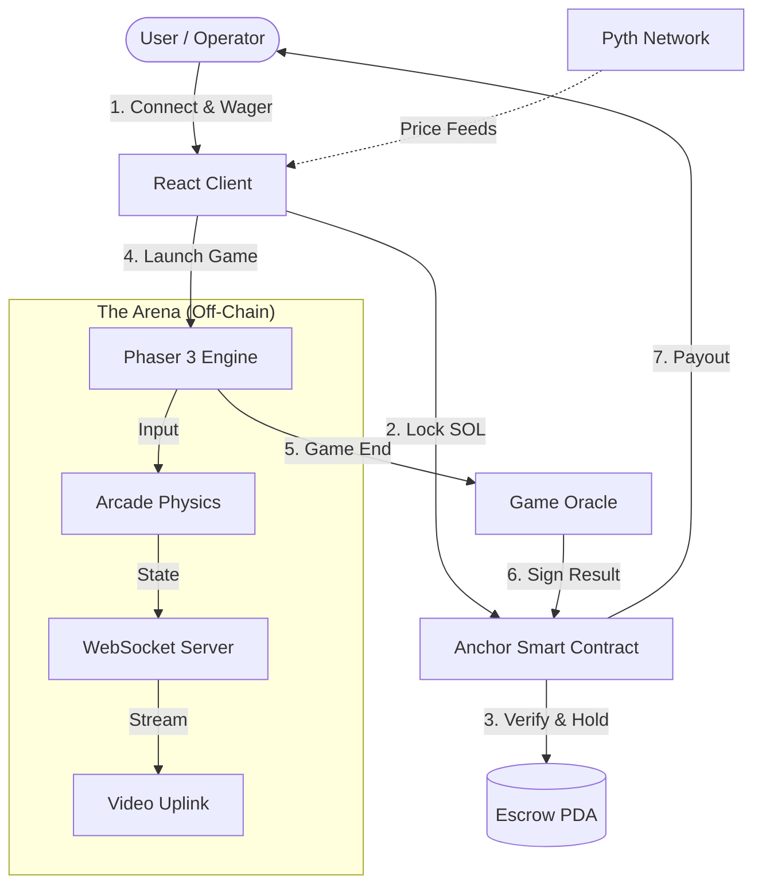

<div align="center">
  

  <br />
  
  <h1 style="font-size: 3rem; margin-bottom: 0;">OUTLAND: EFFECT & CAUSE</h1>
  <p style="font-size: 1.5rem; font-style: italic; margin-top: 0;">
    "Where Violence Pays Off."
  </p>
  
  <p>
    <strong>The First Financial FPS on Solana. Wager on your aim. Verified On-Chain.</strong>
  </p>

  <p>
    <a href="https://solana.com">
      
    </a>
    <a href="https://phaser.io">
      
    </a>
    <a href="https://react.dev">
      
    </a>
    <a href="https://pyth.network">
      
    </a>
    
    
  </p>

  <h3>
    <a href="https://outland-effect-and-cause.vercel.app/">🔴 ENTER THE ARENA (LIVE DEMO)</a> | 
    <a href="https://www.youtube.com/watch?v=XnHkBGVhAd4">🎬 WATCH TRAILER</a> | 
</h3>
</div>

---

##  Transmission 001: The Setting

> "In the post-fiat era, liquidity is no longer printed—it is extracted. The Outland Protocol was established to resolve disputes and reallocate wealth through the only metric that cannot be forged: **Ballistics."

*OUTLAND* creates a new category of Web3 gaming: *The Financial FPS*.

Most blockchain games are passive "click-to-earn" dashboards that rely on inflationary tokenomics. OUTLAND is a *Zero-Sum Skill Market. It functions like a high-frequency derivatives trading platform, but the "market moves" are determined by your aim. Players enter a lobby by locking **SOL* into a Smart Contract Escrow. The game state is verified via a custom bridge, and the survivor claims the liquidity pool immediately.


---

##  Core Features & Innovations

### 1.  Prediction Protocol (Wagering Logic)
The core of Outland is the Prediction_Market program on Solana.
* *High-Stakes Lobbies:* Players select risk tolerance. Tier 1 (0.1 SOL) vs. Tier 3 (1.0 SOL).
* *Atomic Settlement:* Funds are locked in a PDA (Program Derived Address). The contract logic ensures funds cannot be withdrawn until a Game_Over state is signed by the oracle.
* *Oracle Integration:* We utilize *Pyth Network* price feeds to display the real-time USD value of the wager pool, adding psychological weight to every match.


### 2.  Loadout Selection (Leverage Strategy)
In Outland, your class isn't just a playstyle—it's your financial leverage.
* *Tiered Entry Barriers:* We separate lobbies by capital commitment. Scout (0.1 SOL) allows for low-risk testing, while Heavy (1.0 SOL) is reserved for high-conviction players.
* *Dynamic Yield Multipliers:* Higher risk demands higher reward. The Heavy class unlocks a 3.0x Payout Multiplier, incentivizing players to wager more liquidity for exponential returns compared to the safer 1.5x Scout tier.
* *On-Chain Initialization:* Selecting a loadout immediately constructs the transaction payload. The UI prevents "wrong-tier" transfers by hardcoding the lamport value to the specific class selection before the wallet signature request.


### 3.  "Barnfight" Uplink (Social Layer)
We solved the "loneliness" of Web3 gaming.
* *Face-to-Face Combat:* Using simple-peer and WebRTC, we pipe live video feeds directly into the HUD. You see your opponent's reaction the moment you liquidate them.
* *Psychological Warfare:* This mimics the intensity of 90s LAN parties, brought to the browser.
* *Spectator Betting:* (Beta) Spectators can join the "Barn" channel and side-bet on the active combatants.

### 4.  The Black Market (Diegetic Economy)
An in-game shop that respects the blockchain state.
* *Risk-Adjusted Equipment:* Purchase weapons with SOL directly from your wallet.
* *ROI Calculation:* A "Minigun" costs *0.08 SOL. Players are forced to calculate: *Will this investment yield a kill that covers the cost? This turns every loadout decision into a financial trade.


---

##  Gameplay Loop: The Flow

1.  *Identity Verification:* User connects *Phantom* or *Solflare*. The client checks for sufficient SOL balance.
2.  *Loadout Selection:* User selects a Class (Scout/Soldier/Heavy) and a Wager Tier.
3.  *Liquidity Lock:* User approves a transaction. The program transfers SOL from User Wallet -> Escrow_PDA.
4.  *The Rift:* Players are spawned into a 3-minute Deathmatch instance (Phaser 3).
5.  *Combat:*
    * Movement and shooting are handled by Arcade Physics.
    * Optimistic UI updates provide lag-free feedback.
6.  *Settlement:*
    * Game ends.
    * Winner is determined.
    * Authority signs the result.
    * Smart Contract executes payout_winner.
    * Loser is liquidated; Winner receives Total_Pot - 2.5% Protocol Fee.

---

##  Combat Protocols: Operator Manual

Success in the **Outland** depends on three factors: Latency, Aim, and Dimensional Awareness. Master the controls to ensure efficient liquidation.

### The Input Map
| Key | Action | Description |
| :--- | :--- | :--- |
| **`W` `A` `S` `D`** | **Navigation** | Standard tactical movement. |
| **`MOUSE`** | **Ballistics** | Look / Aim. Precision is your only asset. |
| **`LMB`** | **Discharge** | Fire weapon. Ammo is unlimited; reload time is the penalty. |
| **`SPACE`** | **REALITY BREACH** | **[CRITICAL MECHANIC]** Phase between the **Light Realm** and **Shadow Realm**. |

###  The Reality Breach Mechanic
Outland is not played on a single plane. The arena exists in two superimposed dimensions.
* **The Light Realm:** Visible to all. Standard combat.
* **The Shadow Realm:** A dark, mirror dimension.
* **Tactical Usage:** Press **`SHIFT`** to phase out of the Light Realm to escape fire, flank your opponent unseen, and pop back into reality behind them for the execution.
    * *Warning:* You cannot shoot enemies while you are in a different dimension than them. You must phase back to the same plane to deal damage.

###  How to Engage
1.  **Link Identity:** Connect your Solana Wallet (Phantom/Solflare).
2.  **Select Leverage:** Choose your **Risk Tier** (e.g., 0.1 SOL). This locks your funds into the Escrow PDA.
3.  **Hunt:** Locate the target. Use `SPACE` to outmaneuver them.
4.  **Liquidate:** Reduce opponent HP to 0.
5.  **Settlement:** The Smart Contract validates the kill and instantly transfers the **Total Pot** to your wallet.

---

##  System Architecture & Stack

We engineered a high-performance bridge between the *Solana Blockchain* (Finality) and *Phaser Engine* (60 FPS).

<div align="center">
  
</div>


## Technical Deep Dive
* Frontend: React + Vite. We use recoil for global state management (wallet state, game status).

* Game Engine: Phaser 3. We built a custom React hook usePhaser to mount the game canvas inside the React DOM, allowing UI overlays (React) to sit on top of the game canvas (Phaser).

* Smart Contract: Written in Rust using the Anchor Framework.

* Security: We implement checks to ensure the Escrow account matches the seed derived from the Game_ID and Player_Keys.

* Networking: Hybrid approach.

* Game State: WebSocket (Socket.io) for position syncing.

* Video: WebRTC for peer-to-peer streaming (low latency, low cost).

##  Local Installation & Development
## To run the OUTLAND protocol simulation on your local machine:

Prerequisites
* Node.js v18+

* Rust & Cargo (latest stable)

* Solana CLI Tools

* Phantom Wallet/Solflare Wallet (Extension)

1. Clone the Repository
Bash
```
git clone [https://github.com/Kritagya123611/outland-protocol.git](https://github.com/Kritagya123611/outland-protocol.git)
cd outland-protocol
```
2. Configure Environment
Create a .env file in the root directory:

Code snippet
```
VITE_SOLANA_NETWORK=devnet
VITE_RPC_ENDPOINT=[https://api.devnet.solana.com](https://api.devnet.solana.com)
VITE_PROGRAM_ID=[Your_Program_ID]
```
3. Install & Run Frontend
Bash
```
# Navigate to client
cd frontend

# Install dependencies
pnpm install

# Ignite the interface
pnpm run dev
4. Deploy Smart Contract (Devnet)
Bash

# Navigate to Anchor program
cd anchor

# Build the program
anchor build

# Get your Program ID
solana address -k target/deploy/outland_keypair.json

# Deploy
anchor deploy
```
##  Security & Fairness (Hackathon Note)
* The "Oracle Problem" in FPS Games: Connecting a fast-paced shooter to a blockchain introduces a challenge: How do you prevent a user from hacking the client and telling the blockchain they won?

* For this Hackathon submission, we utilize a Server-Authoritative Signer.

* The Gameplay happens.

* Our Node.js backend verifies the kill logs.

* The Backend (acting as the Oracle) signs the transaction instruction.

* The Smart Contract checks this signature before releasing funds. This prevents users from calling the payout function directly from the client.

##  Roadmap: Phase 2
[ ] Squads Protocol: Pooled wagering for 4v4 Team Deathmatch (TDM).

[ ] The Armory (NFTs): Tokenize weapons as cNFTs (Compressed NFTs) on Solana. Allow players to trade leveled-up guns on Tensor.

[ ] Rent-a-Gun (DeFi): A lending protocol where users can rent high-tier weapons to other players for a cut of their earnings.

[ ] Mobile Uplink: PWA optimization for mobile browser play (Solana Mobile Stack).

##  The Team
Kritagya Jha - Lead Engineer & Founder

Full Stack Architecture

Game Logic (Phaser)

Solana Program (Rust/Anchor)

<div align="center"> <br /> <a href="https://www.google.com/search?q=https://twitter.com/YOUR_HANDLE">🐦 Twitter</a> • <a href="https://www.google.com/search?q=https://github.com/Kritagya123611">🐙 GitHub</a> • <a href="https://www.google.com/search?q=https://linkedin.com/in/YOUR_PROFILE">💼 LinkedIn</a> <br /> <br /> <p><em>Built with adrenaline and caffeine for the Indie.fun Hackathon 2025.</em></p> </div>
